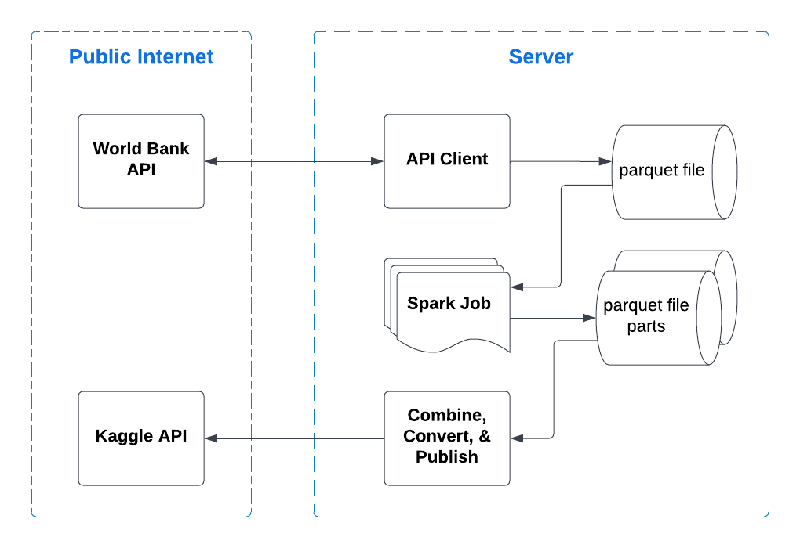

# World Bank Data Pipeline

A scalable PySpark data pipeline designed to process raw World Bank indicators. This project cleans, reshapes, and validates the data, exporting it into standardized formats optimized for data science and machine learning workflows.

## Design


## Run the Data Pipeline

Install dependencies, start the Spark master and workers, then run the pipeline transformation job:

```sh
make install
make run
```

To stop the Spark cluster, run:

```sh
make stop
```

To override the number of Spark SQL shuffle partitions, set `SPARK_SQL_SHUFFLE_PARTITIONS`:

```sh
SPARK_SQL_SHUFFLE_PARTITIONS=8 make run
```

## Testing
Local PySpark tests require a Java runtime. Install Java 17 or newer and set `JAVA_HOME` if the shell cannot find it.

```sh
make test
```


## Data
The pipeline writes 3 Parquet and 3 CSV datasets:

- `world_bank_indicators_long.(parquet|csv)` - one row per country, year, and indicator.
- `world_bank_indicators_indicator_wide.(parquet|csv)` - one row per country, year, and topic, with indicators as columns.
- `world_bank_indicators_year_wide.(parquet|csv)` - one row per country, indicator, and topic, with years as columns.


## Data Source
This project uses publicly available data from the World Bank Open Data initiative.
Source: https://data.worldbank.org/
World Bank data is licensed under the Creative Commons Attribution 4.0 International (CC BY 4.0) License.
© The World Bank. Modified and redistributed under the terms of CC BY 4.0.
