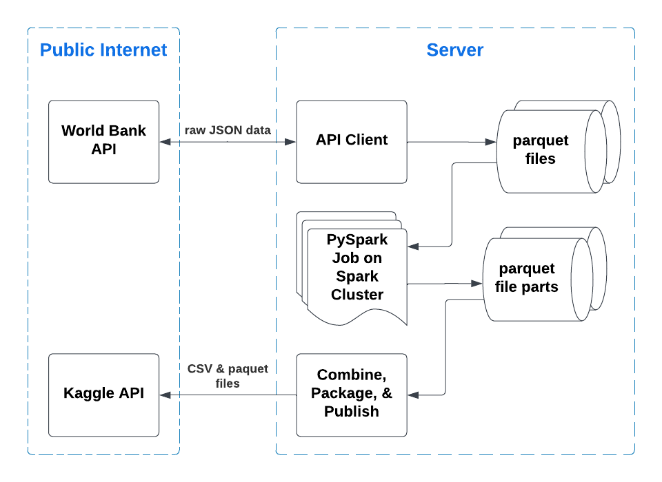

# World Bank Data Pipeline

A scalable PySpark data pipeline designed to process raw World Bank indicators. This project cleans, reshapes, and validates the data, exporting it into standardized formats optimized for data science and machine learning workflows.

## Design Architecture


Although the current dataset can be processed locally, Spark is used to model a scalable distributed ETL architecture and to support larger indicator/topic expansions over time.

## Data
The pipeline writes 3 Parquet and 3 CSV datasets to Kaggle.com:

- `world_bank_indicators_long.(parquet|csv)` - one row per country, year, indicator, and topic.
- `world_bank_indicators_indicator_wide.(parquet|csv)` - one row per country, year, and topic, with **indicators as columns**.
- `world_bank_indicators_year_wide.(parquet|csv)` - one row per country, indicator, and topic, with **years as columns**.

## Data Pipeline Execution

The pipeline runs through Docker Compose and executes the following stages:

1. Start the Spark master and worker containers.

2. Run the World Bank API ingestion job, which fetches raw indicator data and writes it to raw Parquet files.

3. Submit the PySpark transformation job to clean, validate, and reshape the raw data.

4. Package Spark output part files into final Parquet and CSV datasets.

5. Publish the final datasets to Kaggle.

6. Shut down the Spark cluster.

The current pipeline requires a Kaggle username and key to upload the output datasets to Kaggle. Set the `KAGGLE_USERNAME` and `KAGGLE_KEY` environment variables before running the pipeline.

```sh
./run_pipeline.sh
```

To override the number of Spark SQL shuffle partitions, set `SPARK_SQL_SHUFFLE_PARTITIONS`:
```sh
SPARK_SQL_SHUFFLE_PARTITIONS=8 ./run_pipeline.sh
```

## Data Validation
The PySpark transformation job validates the data at each major stage so bad records fail fast with clear error messages instead of silently producing incorrect datasets. The validation checks include:

- Required input and output columns are present before each stage runs.
- Year fields are valid four-digit integers within a reasonable range.
- Indicator values are numeric when present, while intentionally missing values are handled before final output.
- Country and series identifiers are present and not blank.
- Normalized Spark column types match the expected schema for country, series, year, value, and topic fields.
- Cleaning and normalization steps preserve expected row counts when the transformation should not add or remove records.
- Final long-format data is non-empty after topic mapping.
- Duplicate rows  are rejected before outputs are written, including long-format, indicator-wide, and year-wide rows.

## Testing
Local PySpark tests require a Java runtime. Install Java 17 or newer and set `JAVA_HOME` if the shell cannot find it.

```sh
make test
```


## Data Source
This project uses publicly available data from the World Bank Open Data initiative.
Source: https://data.worldbank.org/
World Bank data is licensed under the Creative Commons Attribution 4.0 International (CC BY 4.0) License.
© The World Bank. Modified and redistributed under the terms of CC BY 4.0.
